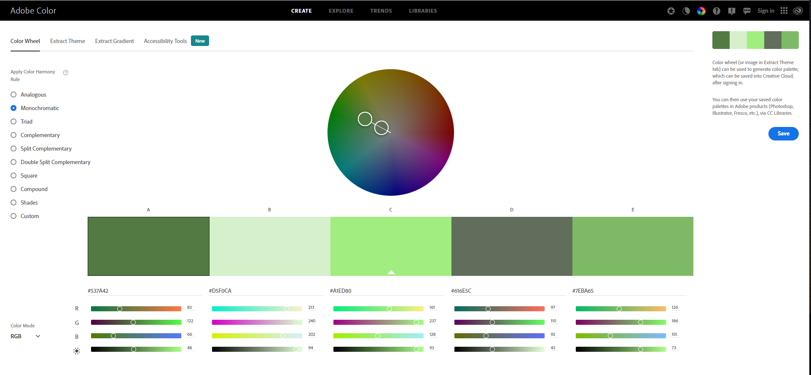

# Friends Of The Forest

[Visit the live webpage](https://felipesandoli.github.io/friends-of-the-forest/)

# Table of Content

1. **[Project Overview](#1-project-overview)** 
    1.1. **[Project Objectives](#11-project-objective)** 
    1.2. **[User Stories](#12-user-stories)** 
    1.3. **[Design](#13-design)** 
2. **[Features](#2-features)** 
    2.1. **[Header, Nav, Logo and Favicon](#21-header-nav-logo-and-favicon)** 
    2.2. **[About Us section](#22-about-us-section)** 
    2.3. **[Information section](#23-information-section)** 
    2.4. **[Further Informaiton](#24-further-information)** 
        &emsp;2.4.1. **[Come Stay With Us form](#241-come-stay-with-us-form)** 
        &emsp;2.4.2. **[Masterclass registration form](#242-masterclass-registration-form)** 
        &emsp;2.4.3. **[Newsletter registration form](#243-newsletter-registration-form)** 
        &emsp;2.4.4. **[Video section](#244-video-section)** 
3. **[Testing](#3-testing)** 
    3.1. **[HTML Validator](#31-html-validator)** 
    3.2. **[CSS Validator](#32-css-validator)** 
4. **[Deployment](#4-deployment)** 
5. **[Credits](#5-credits)** 
    5.1. **[Why Agroforestry Section Information](#51-why-agroforestry-section-information)** 
    5.2. **[Flexbox Tutorial](#52-flexbox-tutorial)** 

# 1. Project Overview

## 1.1. Project Objective

The primary objective of the project is to promote agroforestry as a sustainable alternative to conventional agricultural practices.

The user can get to know how a family run farm is implementing agroforestry practices visiting the farm or registering for a masterclass. The user can also understand why this is important and sign up for periodical news about the topic.

## 1.2. User Stories

### First time users

- As a first time user I want to know what the website is about.
- As a first time user I want to know how I can learn more about agroforestry.
- As a first time user I want to know what the website offers.
- As a first time user I want to check out the company social media profiles.

### Returning users

- As a returning user I want to subscribe to the newsletter.
- As a returning user I want to book a stay at the farm.
- As a returning user I want to send a message to give a feedback.
- As a returning user I want to register my interest in joining a masterclass.

### Site owner

- As a site owner I want to promote sustainable farming practices.
- As a site owner I want to provide more information about agroforestry.
- As a site owner I want to provide a way for our users to book a stay at our farm.

## 1.3. Design

The website was design to have most of the content on the homepage. For this to work, a simple minimalistic design was necessary. To draw attention text content are inserted in boxes contrasting with the background.

The color green was chosen to match the forest theme and the image in the about us section. To define the colors and ensure high contast between the two main colors used throughout the website, the color wheel feature from adobe website was used with the monocromatic color harmony rule.

Only the first two colors were used to guarantee a simple, minimalistc style.

For a distinct feel, the About Us section was placed over a background image of a forest, maintaining the color scheme of the rest of the website.

The "Why Agroforestry?" and "Want to Know More?" sections were both divided in three parts to maintain balance, and to avoid repetition, the first was divided vertically while the second was divided horizontally.

Jost font from Google fonts was used throughout the whole website with a fallback to sans-serif.

# 2. Features

## 2.1 Header, Nav, Logo and Favicon

## 2.2 About Us section

## 2.3 Information section

## 2.4 Further information

### 2.4.1 Come Stay With Us form

### 2.4.2 Masterclass registration form

### 2.4.3 Newsletter registration form

### 2.4.4 Video section

## 2.5 Footer, Contact Us and Social Media links

# 3. Testing

## 3.1. HTML Validator

All pages were validated using the W3C Markup Validator. The first validation indicated a few errors caused by a typo inside an element tag, the use of a styling attribute inside the iframe tag and a duplicated body closing tag. The errors were fixed and all pages passed validation afterwards.

### Home Page

### Contact Us Page

### Stay With Us Page

### Masterclass Page

### Newsletter Page

## 3.2. CSS Validator

# 4. Deployment

# 5. Credits

## 5.1 Why Agroforestry Section Information

The following sources were used to gather information for the Why Agroforestry section:

[https://www.investopedia.com/...](https://www.investopedia.com/articles/investing/100615/4-countries-produce-most-food.asp#:~:text=The%20world's%20top%20four%20food,production%20plays%20in%20their%20economies.) 
[https://g1.globo.com/...](https://g1.globo.com/economia/noticia/2022/07/06/mais-de-60-milhoes-de-brasileiros-sofrem-com-inseguranca-alimentar-diz-fao.ghtml) 
[https://www.worldagroforestry.org/...](https://www.worldagroforestry.org/about/agroforestry) 
[https://www.soilassociation.org/...](https://www.soilassociation.org/farmers-growers/technicalinformation/agroforestry-on-your-farm/agroforestry-and-farm-woodland-e-learning/) 

## 5.2 Flexbox Tutorial

The following tutorial was used to position the elements using flexbox:

[https://css-tricks.com/...](https://css-tricks.com/snippets/css/a-guide-to-flexbox/)