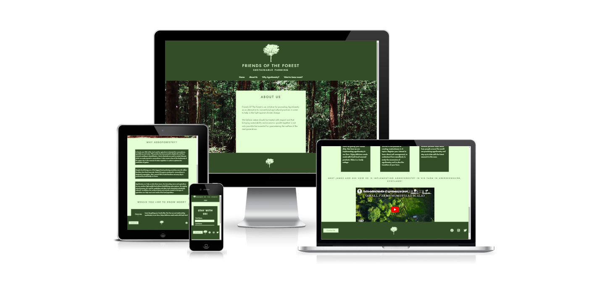

# Friends Of The Forest

[Visit the live webpage](https://felipesandoli.github.io/friends-of-the-forest/)

Developer: Carlos Felipe Capobianco Sandoli

# Table of Content

1. **[Project Overview](#1-project-overview)** 
    1.1. **[Project Objectives](#11-project-objective)** 
    1.2. **[User Stories](#12-user-stories)** 
    1.3. **[Design](#13-design)** 
    1.4. **[Wireframes](#14-wireframes)** 
2. **[Features](#2-features)** 
    2.1. **[Header, Nav, Logo and Favicon](#21-header-nav-logo-and-favicon)** 
    2.2. **[About Us section](#22-about-us-section)** 
    2.3. **[Information section](#23-information-section)** 
    2.4. **[Further Information](#24-further-information)** 
    2.5. **[Footer, Contact Us and Social Media links](#25-footer-contact-us-and-social-media-links)** 
    2.6. **[Form Pages](#26-form-pages)** 
3. **[Testing](#3-testing)** 
    3.1. **[HTML Validator](#31-html-validator)** 
    3.2. **[CSS Validator](#32-css-validator)** 
    3.3. **[Accessibility Validator](#33-accessibility-validator)** 
    3.4. **[Lighthouse](#34-lighthouse)** 
    3.5. **[Manual Testing User Stories](#35-manual-testing-user-stories)** 
4. **[Deployment](#4-deployment)** 
5. **[Credits](#5-credits)** 
    5.1. **[Why Agroforestry Section Information](#51-why-agroforestry-section-information)** 
    5.2. **[Flexbox Tutorial](#52-flexbox-tutorial)** 
    5.3. **[Media](#53-media)** 

# 1. Project Overview

## 1.1. Project Objective

The primary objective of the project is to promote agroforestry as a sustainable alternative to conventional agricultural practices.

The user can get to know how a family run farm is implementing agroforestry practices visiting the farm or registering for a masterclass. The user can also understand why this is important and sign up for periodical news about the topic.

The target audience is people that work or would like to work with agriculture and would like to do so in a sustainable way.

## 1.2. User Stories

### First time users

- As a first time user I want to know what the website is about.
- As a first time user I want to know how I can learn more about agroforestry.
- As a first time user I want to know what the website offers.
- As a first time user I want to check out the company social media profiles.

### Returning users

- As a returning user I want to subscribe to the newsletter.
- As a returning user I want to book a stay at the farm.
- As a returning user I want to send a message to give a feedback.
- As a returning user I want to register my interest in joining a masterclass.

### Site owner

- As a site owner I want to promote sustainable farming practices.
- As a site owner I want to provide more information about agroforestry.
- As a site owner I want to provide a way for our users to book a stay at our farm.

## 1.3. Design

For a clear understanding of the purpose of the website, it was designed to have most of the content on the homepage. For this to work, a simple minimalistic design was necessary. To draw attention text content are inserted in boxes contrasting with the background. The user can find relevant information and what is offered through scrolling down the page or following the navigation links provided in the header.

Semantic markup was used to ensure a well structured page.

The color green was chosen to match the forest theme and the image in the about us section. To define the colors and ensure high contast between the two main colors used throughout the website, the color wheel feature from adobe website was used with the monocromatic color harmony rule. Due to low contrast between text and background colors, spotted by using the Wave validator, the colors were slightly changed to increase contrast.

Media Queries were used to allow for the layout to adapt to all screen sizes maintaining the structural integrity of the website.

For a distinct feel, the About Us section was placed over a background image of a forest, maintaining the color scheme of the rest of the website.

The "Why Agroforestry?" and "Want to Know More?" sections were both divided in three parts to maintain balance, and to avoid repetition, the first was divided vertically while the second was divided horizontally.

Jost font from Google fonts was used throughout the whole website with a fallback to sans-serif.

## 1.4. Wireframes

    
Home Page

    

    
Form Pages

    

# 2. Features

The website consist on a main home page and 4 form pages for the website services.

## 2.1 Header, Nav, Logo and Favicon

The header is displayed in all pages, it contains a logo image, a title, a subtitle and a navigation menu. The navigation menu on the home page contains a link to all sections in the page. In the form pages it contains only a link back to the home page.

In mobiles the subtitle was removed in order to reduce the size of the header.

## 2.2 About Us section

The about us section defines the purpose of the website and explains what drove the site owner to create the website.

## 2.3 Information section

"Why Agroforestry" is an information section, where the user can understand why we believe the subject of the website is important. It contains relevant information about agriculture in Brazil, which is the country where the project was first idealized.

## 2.4 Further information

The third section of the home page is where the user can find what are the services the website provides. The section is divided in three parts, each with a link to a form for registering the users interest and a short description of what is offered.

In desktops, this section was designed to contain the three sections aligned horizontaly with the link to the form at the top. For mobiles, a structure similar to the "Why Agroforestry" section was used with the links set to the left of the text description.

At the bottom of the section, an informative video was added for the user to understand more about the topic.

Future features of this section could include incrementing the complexity of the booking system, adding payment methods and more information about the masterclasses.

## 2.5 Footer, Contact Us and Social Media links

The footer containes a link to the contact us form, where the user can send the site owner a feedback or request any aditional information they might need. The user can also find links the social medias. At present the links take the users to the home page of the social media platforms as the website still doesn't have any social media profiles.

The logo image was added to the footer to keep the overall design balanced.

## 2.6 Form Pages

All forms follow the same structure, with a heading on the left and the form on the right. The contact us form also contain a short paragraph below the heading. The forms only differ from one another in the inputs.

In mobiles the form was restructured so the heading and paragraph, when present, to be at the top of the form.

# 3. Testing

## 3.1. HTML Validator

All pages were validated using the W3C Markup Validator. The first validation indicated a few errors caused by a typo inside an element tag, the use of a styling attribute inside the iframe tag and a duplicated body closing tag. The errors were fixed and all pages passed validation afterwards.

### Home Page

### Contact Us Page

### Stay With Us Page

### Masterclass Page

### Newsletter Page

## 3.2. CSS Validator

For validating the CSS, the style.css file was uploaded to the W3C Jigsaw Validation service. The first try indicated a value error for some font-weight properties. These were fixed and the CSS code passed the second validation.

## 3.3. Accessibility Validator

Wave Accessibility Validator was used to ensure the website was up to the standards. Initially the page got a few errors due to little contrast between text and background colors. After changing the colors, the page passed validation with a few warnings due to heading hierarchy being skipped.

## 3.4. Lighthouse

Lighthouse was used to test the website performance reaching a score of 93.

## 3.5. Manual Testing User Stories

| User Story | Testing |
| ---------- | ------- |
| As a first time user I want to know what the website is about | Clickin on the about us navigation link or scrolling down wil take the user to the about us section where they will find the information |
| As a first time user I want to know how I can learn more about agroforestry | Clicking on the Want to know more? navigation link or scrolling further down will take the user to the corresponding section where they will find out options to learn more about agroforestry |
| As a first time user I want to know what is offered | Again in the want to know more section, the user can see what is offered in the website. In addition the user can click on the contact us button in the footer of the page, which will take them to a form where they can send a message requesting further information |
| As a first time user I want to check out the company social media profiles | The user can find links to the social media in the footer in any page of the website |
| As a returning user I want to subscribe to the newsletter | Going to the want to know more section and clicking in the join our newsletter link will take the user to a form, which they can complete to be registered |
| As a returning user I want to book a stay | Again in the want to know more section, the user can click in the come stay with us section that will take the user to a form to book a stay |
| As a returning user I want to register my interest in joining a masterclass | Clicking in the Interested in a masterclass link in the want to know more section will take the user to another form, here they can select which topic is of their interest before submitting the form |
| As a site owner I want to promote sustainable farming practices | This objective is stated in the about us section and can be realized by the services provided in the want to know more section. Also in the Why agroforestry section, it is displayed some information about why this is important |
| As a site owner I want to provide more information about agroforestry | This is displayed in the Why agroforestry section as well as in the video in the know more section. The user can also book a stay, join a masterclass our a newsletter by filling the respective forms to find out more about the topic |
| As a site owner I want to provide a way to our users to book a stay at our farm | This is possible through the come stay with us form. The user can also send a question through the contact us form, in case they need any additional information |

## 3.6. Bugs and Fixes

Some bugs that were found and fixed throughout development:

| **Bug** | **Fix** |
| ------- | ------- |
| Contact Us button text desappeared when hovering the border or padding | This was caused by placing the anchor element inside a div and styling the div as the button, when hovering the div, the background color changed, but not the text, as the anchor wasn't being hovered over. To fix this, the div element was removed and the anchor alone styled to be a button |
| About Us section text outside going beyond the parent container in screens of smaller widhts | Caused by the fixed height set to the parent container. The fixed height was changed to min-height so the parent container can follow the size of the text inside it |
| About us background image not loading | Caused by wrong file path. This was fixed by changing the file path to correctly follow the directory structure |

# 4. Deployment

The website was developed using GitPod and deployed through GitHub Pages.
For deploying with GitHub Pages the following steps were taken:

1. Navigate to the repository in GitHub
2. Select the Settings tab
3. On the left navigation menu, under Code and Automation, select Pages
4. Select Deploy from a branch under source
5. Select the main branch
6. After the pages reload, the link to the deployed page will show up at the top.

You can see the GitHub repository by clicking [here](https://github.com/felipesandoli/friends-of-the-forest).

# 5. Credits

## 5.1. Why Agroforestry Section Information

The following sources were used to gather information for the Why Agroforestry section:

[https://www.investopedia.com/...](https://www.investopedia.com/articles/investing/100615/4-countries-produce-most-food.asp#:~:text=The%20world's%20top%20four%20food,production%20plays%20in%20their%20economies.) 
[https://g1.globo.com/...](https://g1.globo.com/economia/noticia/2022/07/06/mais-de-60-milhoes-de-brasileiros-sofrem-com-inseguranca-alimentar-diz-fao.ghtml) 
[https://www.worldagroforestry.org/...](https://www.worldagroforestry.org/about/agroforestry) 
[https://www.soilassociation.org/...](https://www.soilassociation.org/farmers-growers/technicalinformation/agroforestry-on-your-farm/agroforestry-and-farm-woodland-e-learning/) 

## 5.2. Flexbox Tutorial

The following tutorial was used to position the elements using flexbox:

[https://css-tricks.com/...](https://css-tricks.com/snippets/css/a-guide-to-flexbox/)

## 5.3. Media

The media used in the website:

- [Favicon](assets/images/favicon.ico): Edited from Royalty Free image taken from [Rawpixel](https://www.rawpixel.com/image/6233525/png-sticker-tree)
- [Forest in About Us section](assets/images/forest.avif): Photo by: Imat Bagja Gumilar taken from [Unsplash](https://unsplash.com/photos/jwTvCQQJXh0)
- [Logo Image](assets/images/tree-logo-solid.avif): Edited from Royalty Free image taken from [Rawpixel](https://www.rawpixel.com/image/6233525/png-sticker-tree)
- [Video in Know more section](https://www.youtube.com/watch?v=iO0ycMkr8lo): Created by [Regenerative Films](https://www.youtube.com/c/RegenerativeFilms)